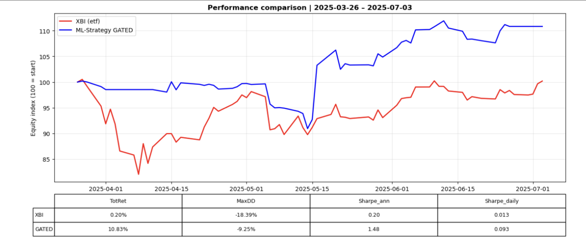

### EXECUTIVE MODULE - Machine Learning Event-Driven Trading Framework (Small-Cap Biotech, End-of-Day)

#### Problem Statement  

**Universe:** U.S. biotech equities with market cap **100M–2B**.

Small-cap biotech stocks are **highly event-driven**:  
FDA approvals, clinical trial results, or partnership news can trigger **double-digit price moves**.  

Yet, due to **low liquidity**, **limited analyst coverage**, and **high noise**, these moves often take **days to stabilize**, creating **short-lived inefficiencies**.  

This project develops a **machine learning event-driven trading pipeline** (daily bars) that ingests:  
- News (RSS + API)  
- NLP sentiment  
- Technical indicators  
- Options data  
- Macro signals  

to generate **regime-aware ML signals**.  

Trades are executed at **T+1 open** (not intraday), since the strategy relies on **daily features** and avoids look-ahead bias.  

**Goal:** exploit delayed post-news adjustments and test if a **systematic ML approach** can beat passive biotech exposure (**XBI**).  

---

## Data & Feature Engineering
T = News
#### Aligned at time T:
- **News & NLP**  
  - Google News RSS + Finnhub (deduplication, normalized titles).  
  - FinRoBERTa (naïve sentiment: neg/neu/pos + compound).  
  - FinBERT OOF (tuned): `nlp_logit`, `nlp_margin`, `nlp_entropy`.  
  - Interpretable event flags: FDA, clinical trials, M&A, legal.


#### Aligned at time T -1(day):
- **Options (Polygon.io)**  
  - Average call IV, put/call ratio, total and per-contract volumes.  
  - IV skew with robust handling of missing put-side data.  
  - Robust transformations: log1p (`opt_avg_iv_call_ln`), median imputations, constrained forward-fill.  

- **Technical (per ticker)**  
  - ATR/volatility 5–10d, momentum 5–20d.  
  - 20d cumulative return, 20d max drawdown, volume spikes.  

- **Sector & Macro**  
  - IBB and XBI: volatility, spreads, relative strength, accelerations.  
  - VIX (level + derivatives).  
  - Yield curves (2s10s, 3m–10y).  
  - USD (DTWEXBGS), IG/HY OAS, NFCI.  

- **Anti-leakage safeguards**  
  - All series shifted to T−1.  
  - Backward `merge_asof` on a business-day calendar.

---

**Transformations.** I did not systematically stationarize all features in order to preserve **regime signals** (trend/volatility) that are crucial in small-cap biotech.  
The risk of drift is mitigated by **time-aware validation** and by a **meta-gate** that reduces exposure in unfavorable phases.  
I plan to evaluate **selective and causal stationarization** on features at risk (e.g., levels of implied volatility, volumes, and indices).  

---


## Methods

To ensure a robust evaluation, the project adopts **Purged K-Fold cross-validation with embargo**, inspired by Marcos López de Prado’s *Advances in Financial Machine Learning* (2018). Unlike standard K-Fold, which assumes i.i.d. samples and introduces leakage in financial time series, this method enforces strict time ordering, removes overlapping periods, and applies an embargo around test windows. This approach mitigates look-ahead bias and produces more realistic out-of-sample estimates.

For modeling, we use an **ensemble stacking architecture**, combining XGBoost and Random Forest as base learners, both tuned via Bayesian Optimization, with a Logistic Regression meta-learner (L2 Ridge regularization). XGBoost captures non-linear interactions, Random Forest reduces variance through bagging, and Logistic Regression stabilizes and calibrates the stacked probabilities into well-behaved outputs.

On top of this ensemble, we introduce a **regime-aware meta-gating layer**, inspired by Jacobs et al. (1991) on *Adaptive Mixtures of Local Experts*. A secondary classifier learns to recognize macro and volatility regimes in which the base ensemble is more reliable. Final probabilities are then blended through a soft gate: in favorable regimes the signal is amplified, while in unfavorable regimes it is dampened or switched off. This mechanism allows the trading engine to adapt dynamically to shifting market conditions, concentrating exposure only when the expected edge is higher.  

---

## Backtest Design

The trading engine is implemented as a **deterministic, daily-bar backtester** that simulates the execution of model signals under realistic constraints. Signals generated on day *T* are executed on *T+1* at the open (or close if the open is missing), ensuring no look-ahead bias.  

Positions are sized by risk, based on current equity and an ATR-derived stop distance, with risk per trade scaled by model confidence. Execution accounts for both **commissions (10 bps)** and **slippage (40bps)** on entry and exit, ensuring returns are net of costs(~100 bps round trip).  

Trade management includes multiple exit rules: fixed profit target (+7%), stop loss (−4%), trailing stop proportional to ATR, and a time-based exit after 5 days. A “hard stop” proxy is also applied to approximate intraday crashes using daily bars.  

At the portfolio level, a **global kill-switch** closes all positions and halts trading if drawdown from peak equity exceeds −30%. This enforces strict risk control and avoids catastrophic losses in adverse regimes.  

Outputs of the backtester include a **daily equity curve**, a detailed **trade ledger** with entry/exit reasons, and a log of missing data events. These allow performance evaluation through metrics such as CAGR, Sharpe ratio, maximum drawdown, expectancy, and profit factor, all computed net of costs.  

---

## Results 

Our experiments confirm that **a machine learning model can capture regime-dependent signals** in small-cap biotech stocks, but only when combined with a **regime-aware gating mechanism**.

#### Predictive skill (OOF validation)
Using **forward-purged cross-validation with per-ticker embargo (5 days)**, we obtained modest but significant out-of-fold (OOF) performance:
- Base stacker: AUC ≈ **0.562**
- Regime-aware blended: AUC ≈ **0.550**
- Permutation test: **p < 0.001** (non-random skill)
- By quarter: AUC with the strongest edge in **2025Q2 (AUC ~0.60)**.

A “shadow” variant of the model, with modified regime features in the meta gating, reached even higher Area under the curve (AUC ≈ **0.57–0.58 OOF**, ~0.63 in 2025Q2), However, despite the higher classification AUC, realized P&L did not improve, likely due to **imperfect probability calibration**. We believe further calibration (Platt scaling, isotonic regression) and a more regularized stacker (e.g. ElasticNet(l1 + l2) instead of pure Ridge) could allow this higher-AUC model to monetize better. For the current report, we highlight the earlier configuration as the **champion model**, since it delivers stronger realized returns.

**Results (full sample):**
- **BASE (always-on)**: Sharpe(ann) −1.07, Max DD −30.2%, TotRet −27.8%, expectancy −0.65% per trade.  
- **FINAL (always-on, regime blend)**:  Sharpe(ann)−1.72, Max DD −30.1%, TotRet −27.6%, expectancy −0.32%.  
- **GATED (regime-aware filter)**: Sharpe(ann) +1.36, Max DD −9.2%, TotRet +10.8%, expectancy **+0.98% per trade**.  

The gated strategy traded less frequently (424 trades vs 800–1,100 in BASE/FINAL) but with higher quality.

##### Note: CAGR is an annualized metric; given the short horizon, we report Total Return over the sample period to reflect performance in the actual trading window.

#### Benchmark comparison (2025Q2 window)
Over the **three-month period**, the gated strategy outperformed the biotech benchmark **XBI**:

##### ML STRATEGY GATED vs XBI (net of costs | 100bps)(Apr 2025–Jul 2025):
- Tot Returns: GATED **+10.8%** vs XBI **+0.2%**
- MaxDD: GATED **−9.2%** vs XBI **−18.4%**
- Sharpe(ann): GATED **1.48** vs XBI **0.20**
- Beta to XBI: **0.26** (low sector exposure, diversifying)
- Estimated daily **alpha ≈ +0.16%** The daily **IR ≈ 0.0948** implies **t ≈ 0.78** under i.i.d.; using Newey–West (L=4) we get **tₐ ≈ 0.85** with **p ≈ 0.39**, so the result is not statistically significant on this 68-day sample.

  ### Strategy vs Benchmark (XBI)


#### Takeaways
- **Always-on ML models lose money** in this domain; adding regime-awareness is critical.  
- **The gated model turns a negative expectancy into a positive one**, beating both its baselines and the passive ETF benchmark.

- An ML-based event-driven strategy can exploit **post-news inefficiencies in small-cap biotech**. Success does not come from predicting everything, but from learning **when to participate and when to step aside** — a regime-aware approach that transforms a losing model into a profitable one.


---

**Metrics :** At this stage, I prioritized **ROC-AUC** to measure the ranking ability of event-driven opportunities.  
Additional metrics (**log-loss, PR-AUC, precision@k**) are planned as the next step to optimize thresholds and position sizing.  

---
**Cost sensitivity** (Notebook 08/09). We stress-tested transaction costs from **100 bps** round-trip (base) up to **220 bps** (severe). Detailed sensitivity tables/plots are reported in Notebook 09; absolute returns decline as costs rise, as expected.

---

## Limitations & Next Steps

While the first results are promising, it is important to note some limitations that set the scope of this prototype:

- **Data horizon**: due to free API constraints, the dataset currently spans **Jan 2024 – Jul 2025**, which is still a relatively short sample and may not capture all biotech and macro cycles.  
- **Options data**: about **40% of option features are imputed** with simple medians, which reduces the richness of this signal. With more complete data, options could play a stronger role.  
- **NLP features**: sentiment is extracted with FinRoBERTa and FinBERT OOF, but in a relatively **basic form**. More domain-specific NLP (e.g., FDA stage context, clinical nuances) could add edge.  
- **Probability calibration**: probabilities are used raw, without Platt scaling or isotonic regression. Better calibration should improve thresholding and risk management.  
- **Statistical robustness**: performance improvements, especially with the regime gate, are encouraging but still based on a short window. More data are needed for conclusive evidence.
  
----------------------------------------------------
Planned improvements include:  
- Enhanced **options features** with smarter handling of missingness.  
- More advanced **NLP pipelines** tailored to biotech news.  
- **Calibrated probabilities** to improve mapping between predicted confidence and realized outcomes.  
- Additional **risk controls** (exposure caps, liquidity filters, borrowing constraints).

---

## Conclusion

This is a promising prototype. Exploring this niche with a data-driven approach has been genuinely engaging, and I recognize I’m still early in my journey. From here, I’ll stress-test the pipeline, surface weaknesses, and iterate where the strategy can add real value—especially around probability calibration, regime gating, and execution realism.

The next step is live paper trading, which will provide an unbiased read on robustness, capacity, and costs. That evidence will determine whether this can mature into a reliable, event-driven strategy for small-cap biotech. I’m committed to refining it and learning quickly from the results.

*Educational content — not investment advice.*


```python

```
